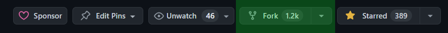

# Cloning the Repository

Cloning the Paradise repository only has to be done once.

1. Visit the [repository][] and press the _Fork_ button in the upper right corner.

   

[repository]: https://github.com/ParadiseSS13/Paradise

2. Launch Visual Studio Code. Select the Source Control panel on the sidebar,
   and click _Clone Repository_.

   

   If that’s not there, you can press `Ctrl`+`Shift`+`P` to open the command
   palette, then type `Git: Clone` and then press `Enter`.

3. Paste the URL of the repository you created in the last step. It should look
   like this: `https://github.com/YOURNAME/Paradise`. Then, select a folder to
   keep your local repository. The process of downloading might take a while.
   Once it’s downloaded, open the folder in Visual Studio Code.

## Installing Recommended Visual Studio Code Extensions

When you first open the Paradise repository in Visual Studio Code, you will also
get a notification to install some recommended extensions. These plugins are
extremely useful for programming with BYOND and should be considered essential.
If you don't see the prompt to install the recommended extensions, they can be
found by searching for `@recommended` in the Extensions panel, or installed from
the list below.

- [DreamMaker Syntax Highlighting](https://marketplace.visualstudio.com/items?itemName=gbasood.byond-dm-language-support)
- [BYOND Language Support](https://marketplace.visualstudio.com/items?itemName=platymuus.dm-langclient)
- [EditorConfig](https://marketplace.visualstudio.com/items?itemName=EditorConfig.EditorConfig)
- [ESLint](https://marketplace.visualstudio.com/items?itemName=dbaeumer.vscode-eslint)
- [GitLens](https://marketplace.visualstudio.com/items?itemName=eamodio.gitlens)
- [ErrorLens](https://marketplace.visualstudio.com/items?itemName=usernamehw.errorlens)
- [DreamMaker Icon Editor](https://marketplace.visualstudio.com/items?itemName=anturk.dmi-editor)
- [Prettier Code Formatter](https://marketplace.visualstudio.com/items?itemName=esbenp.prettier-vscode)
- [ZipFS](https://marketplace.visualstudio.com/items?itemName=arcanis.vscode-zipfs)

## Adding Paracode as an Upstream Repository

We need to add the main Paradise repository as a remote now.

1. Open the command palette (`Ctrl`+`Shift`+`P`), type `Git: Add Remote`, and
   press `Enter`. You'll be prompted for the URL of the remote, and then the name
   of the remote.

2. Enter `https://github.com/ParadiseSS13/Paradise` for the URL, and `upstream`
   for the name. After you've done that, you’ll have the main Paradise
   repository as a remote named `upstream`. This will let you easily send your
   pull requests there later.
