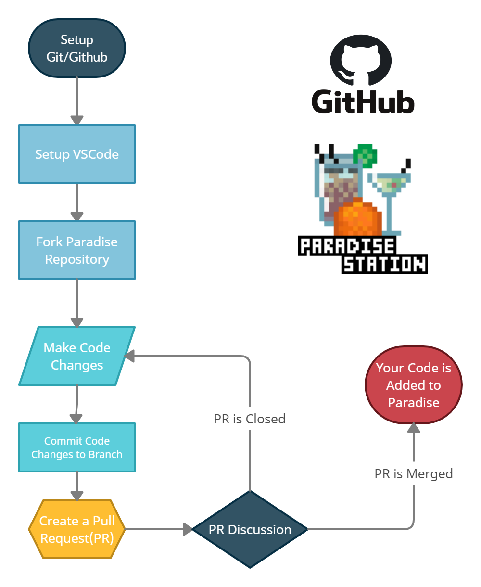
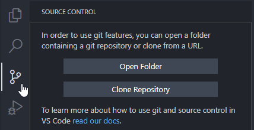

# Getting Started

This section contains all the relevant information for downloading and running a Paradise server locally.

<!-- toc -->



# Development Environment Setup

This guide will walk you through the basic steps of installing Git, the program
that tracks changes to the Paradise codebase, as well as Visual Studio Code, the
recommended editor for working with Paradise.

## Setting Up Visual Studio Code

Visual Studio Code is the recommended editor for working with Paradise and other
SS13 codebases.

1. Go to VSCode's website: <https://code.visualstudio.com/>
2. Download the appropriate build for your system and install it.

## Setting Up Git

Git is the program that allows you to share your code changes with the Paradise
codebase. It is a command line program, but Visual Studio Code provides nearly
all of its functionality within its editor.

### Installing Git

1. Go to the [Git][] website and download the installer for your operating system.
2. Run the installer, leaving all the default installation settings.

[Git]: https://git-scm.com/downloads

### Registering a GitHub Account

GitHub is the service where the Paradise codebase is stored. You'll need a
GitHub account to contribute to Paradise. Go to the [GitHub signup page][] and
register with a username and e-mail account.

[GitHub signup page]: https://github.com/signup

### Hiding Your Email Address

Changes to Git repositories include the e-mail address of the person who made
the change. If you don't wish your email address to be associated with your
development on Paradise, you can choose to hide your email when interacting with
repositories on GitHub:

1. Log into your GitHub account.
2. Go to <https://github.com/settings/emails>.
3. Select the _Keep my email addresses private_ checkbox.

This means that while your e-mail address is associated with your GitHub
account, any changes you make will only be keyed to a generic e-mail address
with your username.

### Additional Help

For instructional videos on Visual Studio Code's GitHub integration, see <https://vscode.github.com/>.

For introductory videos on Git, see:

- [Introduction to Git with Scott Chacon of GitHub](https://www.youtube.com/watch?v=ZDR433b0HJY)
- [Git From Bits Up](https://www.youtube.com/watch?v=MYP56QJpDr4)
- [Linus Torvalds (inventor of Linux and Git) on Git](https://www.youtube.com/watch?v=4XpnKHJAok8)

## Installation for Linux Users

The code is fully able to run on Linux, however Windows is still the recommended
platform. The libraries we use for external functions (rust-g and MILLA) require
some extra dependencies.

### Building rust-g for Debian-based Distributions

1. Download the latest release from <https://github.com/ParadiseSS13/rust-g>
2. Run the following command:
```sh
apt-get install libssl-dev:i386 pkg-config:i386 zlib1g-dev:i386
```
3. After installing these packages, rust-g should be able to build and function
   as intended. Build instructions are on the rust-g GitHub. We assume that if
   you are hosting on Linux, you know what you are doing.
4. Once you've built rust-g, you can build MILLA similarly. Change into the
   `milla/` directory and run:
```sh
cargo build --release --target=i686-unknown-linux-gnu
```

# Cloning the Repository

Cloning the Paradise repository only has to be done once.

1. Visit the [repository][] and press the _Fork_ button in the upper right corner.

   

[repository]: https://github.com/ParadiseSS13/Paradise

2. Launch Visual Studio Code. Select the Source Control panel on the sidebar,
   and click _Clone Repository_.

   

   If that’s not there, you can press `Ctrl`+`Shift`+`P` to open the command
   palette, then type `Git: Clone` and then press `Enter`.

3. Paste the URL of the repository you created in the last step. It should look
   like this: `https://github.com/YOURNAME/Paradise`. Then, select a folder to
   keep your local repository. The process of downloading might take a while.
   Once it’s downloaded, open the folder in Visual Studio Code.

## Installing Recommended Visual Studio Code Extensions

When you first open the Paradise repository in Visual Studio Code, you will also
get a notification to install some recommended extensions. These plugins are
extremely useful for programming with BYOND and should be considered essential.
If you don't see the prompt to install the recommended extensions, they can be
found by searching for `@recommended` in the Extensions panel, or installed from
the list below.

- [DreamMaker Syntax Highlighting](https://marketplace.visualstudio.com/items?itemName=gbasood.byond-dm-language-support)
- [BYOND Language Support](https://marketplace.visualstudio.com/items?itemName=platymuus.dm-langclient)
- [EditorConfig](https://marketplace.visualstudio.com/items?itemName=EditorConfig.EditorConfig)
- [ESLint](https://marketplace.visualstudio.com/items?itemName=dbaeumer.vscode-eslint)
- [GitLens](https://marketplace.visualstudio.com/items?itemName=eamodio.gitlens)
- [ErrorLens](https://marketplace.visualstudio.com/items?itemName=usernamehw.errorlens)
- [DreamMaker Icon Editor](https://marketplace.visualstudio.com/items?itemName=anturk.dmi-editor)
- [Prettier Code Formatter](https://marketplace.visualstudio.com/items?itemName=esbenp.prettier-vscode)
- [ZipFS](https://marketplace.visualstudio.com/items?itemName=arcanis.vscode-zipfs)

## Adding Paracode as an Upstream Repository

We need to add the main Paradise repository as a remote now.

1. Open the command palette (`Ctrl`+`Shift`+`P`), type `Git: Add Remote`, and
   press `Enter`. You'll be prompted for the URL of the remote, and then the name
   of the remote.

2. Enter `https://github.com/ParadiseSS13/Paradise` for the URL, and `upstream`
   for the name. After you've done that, you’ll have the main Paradise
   repository as a remote named `upstream`. This will let you easily send your
   pull requests there later.

# Configuring a Local Database

## Initial setup and Installation

1. Download and install [MariaDB](https://mariadb.com/downloads/mariadb-tx) for
   your operating system. The default installation settings should work. You
   need TCP enabled and to set a root password. If it offers, do _not_ set it up
   to use Windows authentication. If you've ticked Install as a Windows Service
   (should be ticked by default), it will run whenever you boot up your
   computer, so there's no need to worry about starting it manually.

2. Open HeidiSQL (comes with MariaDB) and connect it to the database. Click on
   *New* to create a new session, check *prompt for credentials* and leave the
   rest as default.

3. Click *Save*, then click open and enter in `root` for the username and the
   password you set up during the installation.

4. Select the database you just created and then select *File -> Load SQL File*,
   and open the `paradise_schema.sql` file found in the `SQL/` directory of the
   game.

5. Press the blue "play" icon in the topic bar of icons. If the schema imported
   correctly you should have no errors in the message box on the bottom.

6. Refresh the panel on the left by right clicking it and ensure there's a new
   database called `paradise_gamedb` created.

7. Create a new user account for the server by going to *Tools -> User Manager*.
   'From Host' should be `127.0.0.1`, not `localhost` if hosted locally.
   Otherwise, use the IP of the game server. For permissions, do not give it any
   global permissions. Instead click *Add Object*,  select the database you
   created for the server, click *OK*, then give it `SELECT`, `DELETE`,
   `INSERT`, and `UPDATE` permissions on that database.

8. You can click the arrow on the password field to get a randomly generated
   password of certain lengths. copy the password before saving as it will be
   cleared the moment you hit *Save*.

9. Open the file `config/config.toml` in your text editor (such as VSCode)
   scroll down to the `[database_configuration]` section. You should've copied
   the file over from the `config/example` folder beforehand.

10. Make sure that these settings are changed:
    -   `sql_enabled` is set to `true`.
    -   `sql_version` to the correct version. By starting the server
        with a mismatched version here and all the other settings set
        up, the chat box will tell you the current version in red text,
        between the messages for all the subsystems initializing. Set
        this to the current version.
    -   `sql_address` is set to `"127.0.0.1"`. (Replace with the
        database server's IP if not hosted locally)
    -   `sql_port` is set to whatever port was selected during the
        MariaDB install, usually `3306`.
    -   `sql_database` is set to the name of your database, usually
        `"paradise_gamedb"`.
    -   `sql_username` is set to the 'User name' of the user you
        created above.
    -   `sql_password` is set to the randomly generated 'Password' of
        the user you created above.
-   The database is now set up for death logging, population logging,
    polls, library, privacy poll, connection logging and player logging.
    There are two more features which you should consider. And it's
    best to do so now, since adopting them later can be a pain.

## Database based administration

Offers a changelog for changes done to admins, which increases
accountability (adding/removing admins, adding/removing permissions,
changing ranks); allows admins with +PERMISSIONS to edit other admins'
permissions ingame, meaning they don't need remote desktop access to
edit admins; Allows for custom ranks, with permissions not being tied to
ranks, offering a better ability for the removal or addition of
permissions to certain admins, if they need to be punished, or need
extra permissions. Enabling this can be done any time, it's just a bit
tedious the first time you do it, if you don't have direct access to
the database.

To enable database based administration:

-   Open \\config\\config.toml and scroll to the `[admin_configuration]`
    section.
-   Set `use_database_admins` to `true`.
-   Add a database entry for the first administrator (likely yourself).
-   Done! Note that anyone set in the `admin_assignments` list will no
    longer be counted.
-   If your database ever dies, your server will revert to the old admin
    system, so it is a good idea to have `admin_assignments` and
    `admin_ranks` set up with some admins too, just so that the loss of
    the database doesn't completely destroy everything.


# Publishing Changes

First, let's talk about **branches**. First thing to do is to make a new
branch on your fork. This is important because you should never make
changes to the default(master) branch of your fork. It should remain as
a clean copy of the main ParadiseSS13 github.

**For every PR you make, make a new branch.** This way, each of your
individual projects have their own branch. A commit you make to one
branch will not affect the other branches, so you can work on multiple
projects at once.

### Branching

To make a new branch, open up the source control sidebar. Navigate to
the Branches section and open it. You should only have the master
branch. You can create a new branch by going and clicking on the Create
Branch button.


It will then prompt you at the top of your screen to name your new
branch, then select Create Branch and Switch. For this guide, I'll be
creating a new hat, so I'll name my branch `hat-landia`. If you look at
the bottom left hand corner, you'll see that VS Code has automatically
checked out our
branch:\
Remember, **never commit changes to your master branch!** You can work
on any branch as much as you want, as long as you commit the changes to
the proper branch.\
Go wild! Make your code changes! This is a guide on how to contribute,
not what to contribute. So, I won't tell you how to code, make sprites,
or map changes. If you need help, try asking in the `#spriting` or the
`#coding_chat` Discord channels.

### Changing Code

You'll find your code to edit in the Explorer sidebar of VS Code; if you
need to find something, the Search sidebar is just below that.\

    Old-school style: If you want to use DreamMaker instead, go ahead and edit your files there - once you save them, VS Code will detect what you’ve done and you’ll be able to follow the guide from there.

If you do anything mapping related, it is highly recommended you use
StrongDMM and check out the [Guide to
Mapping](Guide_to_Mapping "wikilink").

Now, save your changes. If we look at the Source Control tab, we'll see
that we have some new changes. Git has found every change you made to
your fork's repo on your computer! Even if you change a single space in
a single line of code, Git will find that change. Just make sure you
save your files.

### Testing Your Code

The easiest way to test your changes is to press **F5**. This compiles
your code, runs the server and connects you to it, as well as
automatically giving you admin permissions. It also starts a debugger
that will let you examine what went wrong when a runtime error happens.
If you want to avoid the debugger press **Ctrl + F5** instead.

If F5 does not automatically start a local server, you might have
installed BYOND on a custom path and VSC did not find it. In this case,
try the following:

1.  Press \"Ctrl - ,\" to open VSC settings.
2.  Type \"DreamMaker\", select \"DreamMaker language client
    configuration\".
3.  Under \"DreamMaker: Byond Path\", add your path to BYOND (for
    example, `D:\Program Files (x86)\BYOND`).
4.  Press OK and close the tab.
5.  Press F5 to run the server.

If that does not work, you can compile it into a dmb file and run it in
Dream Daemon. To do so, select the dmb file, set security to Trusted and
hit GO to run the server. After the server starts you can press the
button above the GO / STOP button (now red) to connect.

Do note that if you compile the game this way, you need to manually make
yourself an admin. For this, you will need to copy everything from
`/config/example` into `/config`. Then you will need to edit the
`/config/config.toml` file by adding a
`{ckey = "Your Name Here", rank = "Hosting Provider"}` line to the
`admin_assignments` list.


Be sure to always test not only if your changes work, but also if you
didn't actually break something else that might be related.

### Committing to Your Branch

Hover over the word **Changes** and press the plus sign to stage all
modified files. It should look like this:


Or, pick each file you want to change individually. Staged files are the
changes you are going to be submitting in commit, and then in your pull
request. Once you've done that, they'll appear in a new tab called
Staged Changes.


Click on one of the code files you've changed now! You'll see a compare
of the original file versus your new file pop up. Here you can see, line
by line, every change that you made. Red lines are lines you removed or
changed, and green lines are the lines you added or updated. You can
even stage or unstage individual lines, by using the More Actions
`(...)` menu in the top right.

Now that you've staged your changes, you're ready to make a commit. At
the top of the panel, you'll see the Message section. Type a descriptive
name for you commit, and a description if necessary. Be concise!

Make sure you're checked out on the new branch you created earlier, and
click the checkmark! This will make your commit and add it to your
branch. It should look like this:


There you go! You have successfully made a commit to your branch. This
is still 'unpublished', and only on your local computer, as indicated by
the little cloud and arrow icon in the bottom left corner.


Once you have it committed, you\'ll need to push/publish to your github.
You can do that by pressing the small cloud icon called \"publish
branch\".

### Publishing to GitHub

Go to the [Main repository](https://github.com/ParadiseSS13/Paradise/)
once your branch is published, Github should then prompt you to create a
pull request. This should automatically select the branch you just
published and should look something like this.


If not, you\'ll need to open a Pull Request manually. You\'ll need to
select \`compare across forks\`, then select the upstream repo and
target the master branch.

Then, you'll be able to select the title of your PR. The extension will
make your PR with your selected title and a default description.
**BEFORE SUBMITTING:** ensure that you have properly created your PR
summary and followed the description template.

A note on changelogs. Changelogs should be player focused, meaning they
should be understandable and applicable to your general player. keep it
simple,

    fix: fixed a bug with X when you Y
    tweak: buffed X to do Y more damage.

Avoid coding lingo heavy changelogs and internal code changes that
don\'t visibly affect player gameplay. These are all examples of what
you shouldn\'t add:

    tweak: added the NO_DROP flag to X item.
    tweak: refactored DNA to be more CPU friendly

ShareX is a super useful tool for contributing as it allows you to make
gifs to display your changes. you can download it,
[here](https://getsharex.com/)

if all goes well, your PR should look like this:

{width="600"}

If you want to add more commits to your PR, all you need to do is just
push those commits to the branch.

</div>
<div class="toccolours mw-collapsible" style="width:99%">
